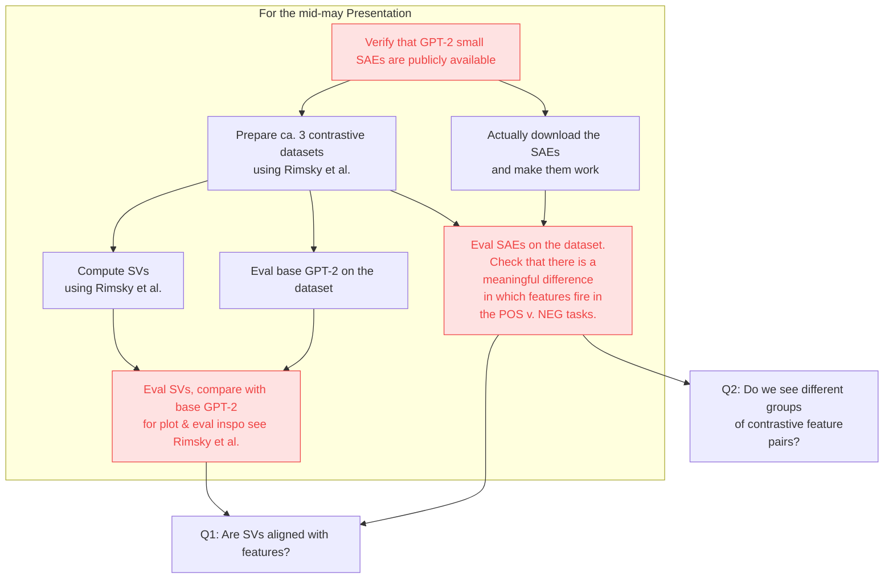

#  Utilizing SAE Features for Activation Steering

Below is a rough flowchart of different things that need to be done, mostly prerequisites for the actual research.

Critical steps that need to work for the project to make sense are highlighted in red, with comments below the flowchart.

## Comments on critical steps

If we fail to reproduce Rimsky — i.e. if our steering vectors don't steer the model — we will have to rethink the whole plan. Maybe GPT-2 is hard to steer on artificial datasets or something.

The SAEs should perform very similarly to base GPT-2 on our datasets. If they don't, there's something wrong with them (or their interaction with the dataset).

If all features fire similarly on the positive and negative examples, we're doing something wrong — or maybe the features are too low-level to capture any high-level ideas like "refusal".

## Research questions

**Q1:  Are SVs aligned with features?** I'd expect a steering vector to be an average of multiple related features that all capture the idea of the steering vector but in different contexts / with slightly different flavours.

**Q2: Do we see different groups of contrastive feature pairs?** This is related to Q1. Say we run SAEs on the contrastive dataset we prepared — can we further "split" the dataset to smaller semantic chunks in which different features fire? For example, in a refusal dataset, can we identify something like "refusal because dangerous" and "refusal because lack of understanding" groups of tasks in which completely different features do the "refusal" part of the job?

Other research questions worth considering:
- Generally inspect how features behave on the contrastive dataset. Are there any "opposite" features?
- Can we use the features for steering?
- How do steering features compare to SVs in performance?
- Can we compute the steering features without the contrastive dataset? E.g. maybe there's a patter
